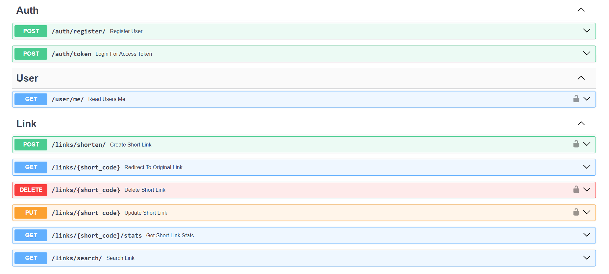
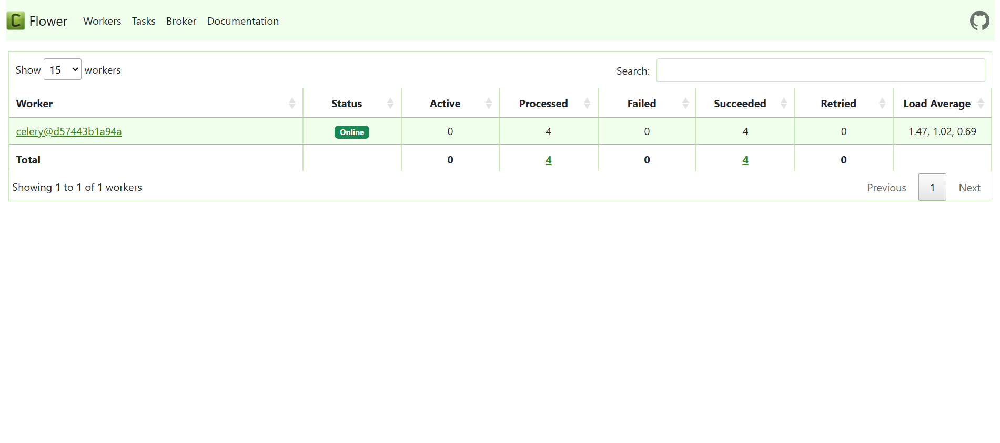

# link-redirect-service

Этот проект представляет собой сервис сокращения ссылок.

## Запуск через Docker

### 1. Клонирование репозитория
```sh
git clone git@github.com:vasilyryabtsev/link-redirect-service.git
cd link-redirect-service
```

### 2. Создание файла окружения
```sh
cp .env.example .env
```

#### Генерация секретного ключа
```sh
openssl rand -hex 32
```
Замените значение `SECRET_KEY` в `.env` на сгенерированный ключ.

### 3. Настройка конфигурации
В файле `src/config.py` установите значение `BASE_URL`, по умолчанию:
```python
BASE_URL = 'http://localhost:8000'
```

### 4. Сборка проекта
```sh
docker-compose up --build
```

Доступ к сервисам

- FastAPI: http://localhost:8000

- Celery Flower (мониторинг задач): http://localhost:5555
