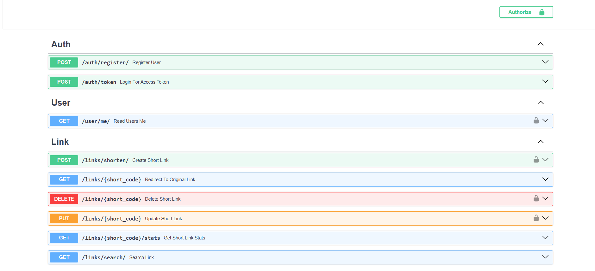
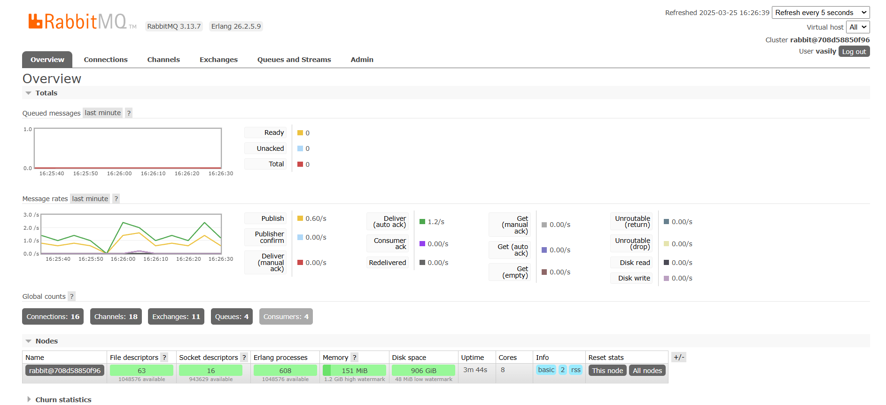
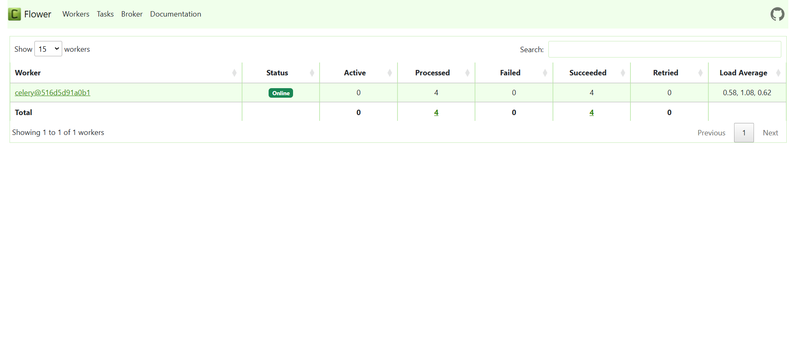
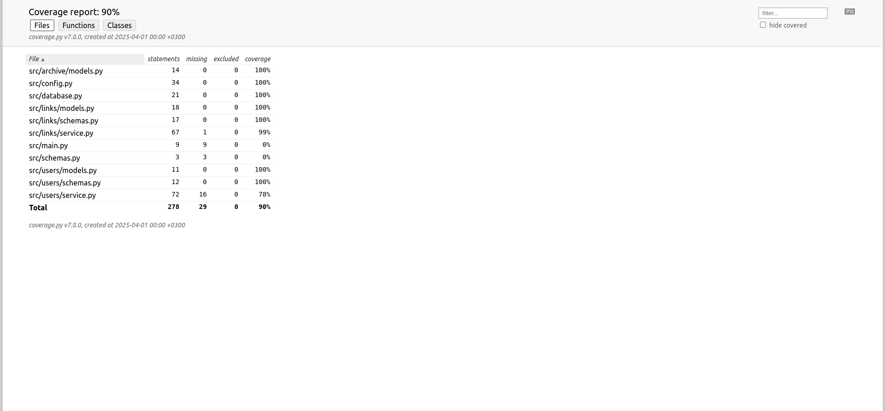

# Link Redirect Service

## Описание

Link Redirect Service - это сервис для создания и управления короткими ссылками с поддержкой регистрации пользователей и панелью управления.

## Стек технологий

- **Backend:** FastAPI
- **База данных:** PostgreSQL
- **Кэширование:** Redis
- **Очередь задач:** RabbitMQ + Celery
- **Контейнеризация:** Docker, Docker Compose
- **Миграции:** Alembic
- **Тестирование:** Pytest

## Структура проекта

```
.
├── Dockerfile
├── LICENSE
├── README.md
├── alembic.ini
├── docker-compose.yml
├── requirements.txt
├── src
│   ├── config.py          # Конфигурационные параметры
│   ├── database.py        # Подключение к БД
│   ├── main.py            # Основной файл запуска FastAPI
│   ├── migrations/        # Миграции Alembic
│   ├── tasks/             # Celery-задачи
│   ├── users/             # Модели и роутеры для пользователей
│   ├── links/             # Модели и роутеры для коротких ссылок
│   ├── archive/           # Модель для удалённых ссылок
├── tests                  # Тесты
```

## Переменные окружения (.env)

Проект использует файл `.env` для настройки конфигурации. Основные параметры:

```env
# PostgreSQL
DB_USER=user
DB_PASS=password
DB_HOST=db
DB_PORT=5432
DB_NAME=links_db

# Redis
REDIS_HOST=redis_app
REDIS_PORT=6379
REDIS_CACHE_EXPIRATION=60

# RabbitMQ
RABBITMQ_HOST=rabbitmq
RABBITMQ_PORT=5672
RABBITMQ_USER=user
RABBITMQ_PASS=password

# FASTAPI
FASTAPI_HOST=localhost
FASTAPI_PORT=8000

# Auth
SECRET_KEY=7e6527672ff804a0c71bbd65f3dd6ff1e8e76bc1ab425e59df2bb84e34b99dfe
ALGORITHM=HS256
ACCESS_TOKEN_EXPIRE_MINUTES=5

# Encoding
LINK_ENCODING_SIZE=5

# Timezone
TIMEZONE=Europe/Moscow

# Celery
CLEAN_UP_EXPIRED_LINKS_TIME=1
UPDATE_STATS_TIME=5
```

## Установка и запуск

### 1. Клонирование репозитория

```sh
git clone git@github.com:vasilyryabtsev/link-redirect-service.git
cd link-redirect-service
```

### 2. Генерация секретного ключа для аутентификации

Перед запуском рекомендуется создать секретный ключ для подписи JWT-токенов:

```sh
openssl rand -hex 32
```

Скопируйте полученное значение и укажите его в `.env` в переменной `SECRET_KEY`.

### 3. Запуск с помощью Docker Compose

```sh
docker-compose up --build
```

## Сервисы

- FastAPI: [http://localhost:8000](http://localhost:8000)
  
  

- RabbitMQ (UI): [http://localhost:15672](http://localhost:15672)
  
  

- Flower (мониторинг Celery): [http://localhost:5555](http://localhost:5555)
  
  

## Тестирование

Для запуска тестов необходимо создать `.env` файл в директории `tests` с параметрами:

```env
# PostgreSQL
DB_USER=user
DB_PASS=password
DB_HOST=localhost
DB_PORT=5432
DB_NAME=links_db_test
```

### Запуск тестов

Запуск тестов из корневой директории:

```sh
python -m pytest --cov src
```

Результаты тестов в формате HTML сохранены в каталоге `htmlcov/index.html`. Открыть их можно в браузере.

